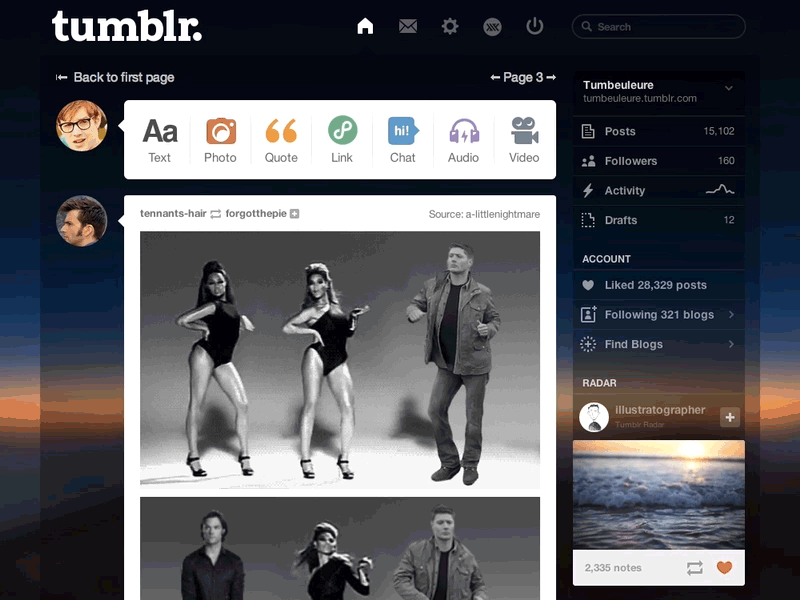

Dawn - a simple Tumblr Dashboard theme for XKit.
===========



The design team at Tumblr made an amazing job, but after quite some time of using the website I felt I needed a fresh look, I was doing an overdose of that dark blue. So there it is, my attempt to make something that doesn't impact too much on the readability and make Tumblr more easy to read when it's bedtime.

## How to install

1. Grab the [XKit extension](http://xkit.info/seven/download/).
2. Once installed, open XKit by clicking on the new XKit icon in the Tumblr menu, click on the 'Get Extensions' tab, and install 'Theme Editor'. 
3. Click on the 'Edit Theme' button in the sidebar, then copy/paste the content of dawn.css. Apply the changes and save. That's it!

## Good, now I have a 'Edit Theme' button on my sidebar that I don't want. How do I get rid of it ?

Simply add the code below to the end of theme:
```
#xkit-theme-editor-ul {
    display: none;
}
```

But be aware that it will hide the button, si if you changed your mind, you have to reset/uninstall the 'Theme Editor' extension in the XKit settings.

I'm working on putting the theme on the XKit theme gallery.

Happy Tumbling!
